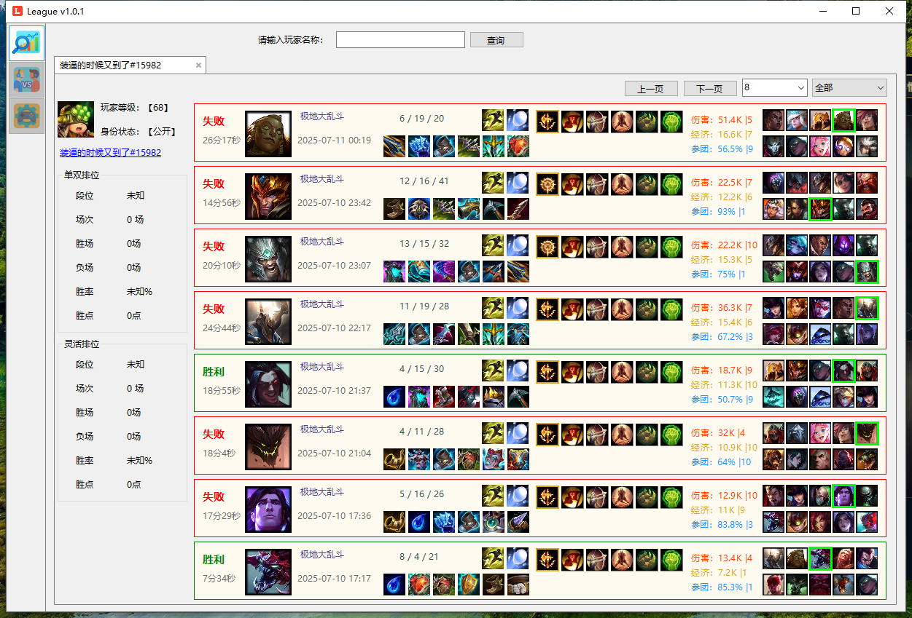
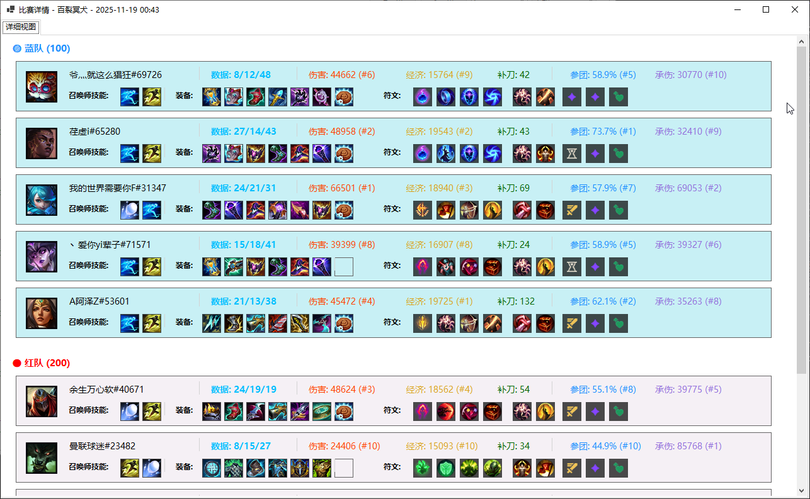
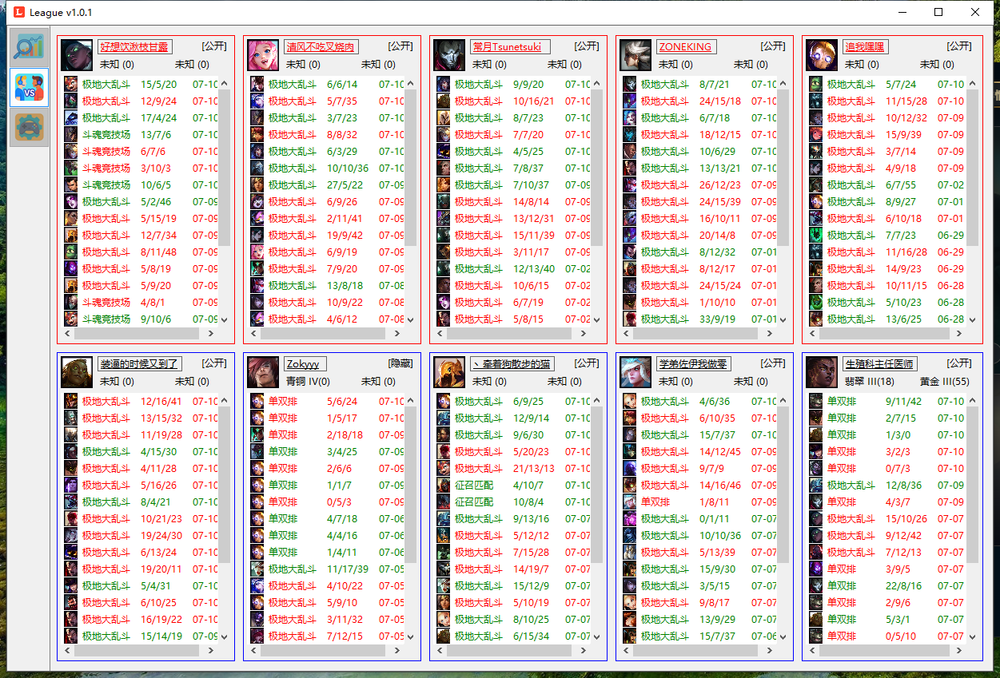
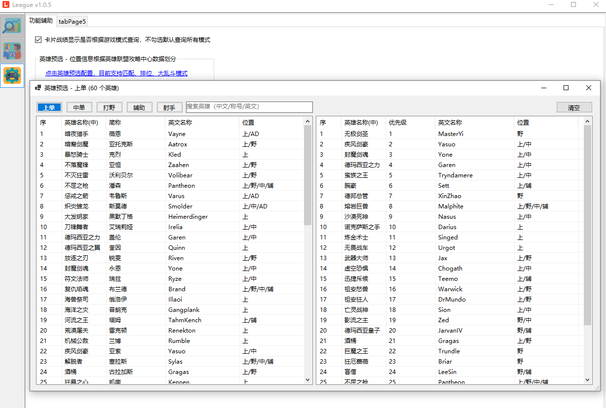
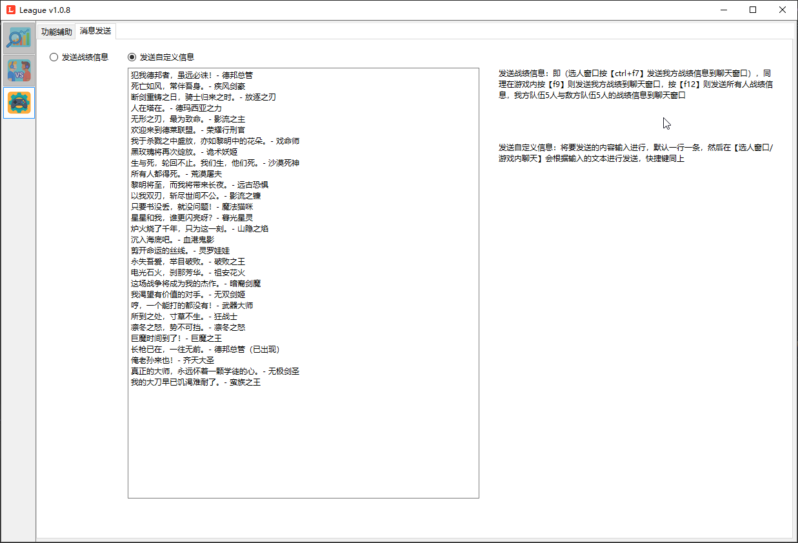
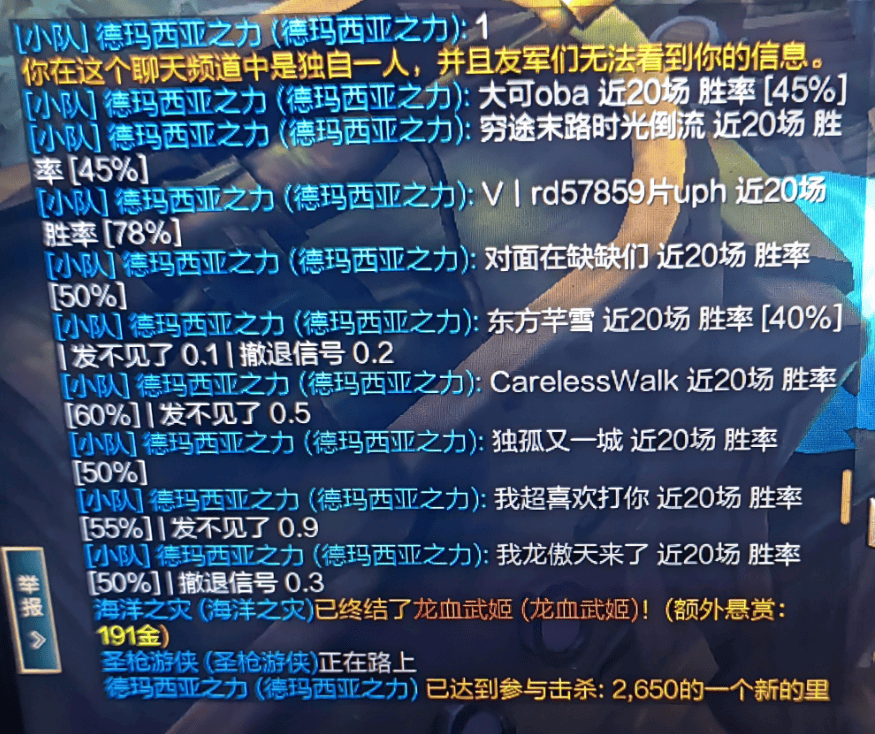

# 联盟视界
英雄联盟国服战绩助手工具 | LoL Data Companion

> 实时查询战绩、卡片展示、选人提醒，让你的峡谷之旅更智能！

---

## 功能特色

### 1. 实时战绩查询
- 软件启动后自动查询当前玩家的战绩
  - 包括胜负、KDA、出装、符文配置
  - 显示本场伤害、经济、参团率及排名（与 WeGame 数据一致）

### 2. 数据筛选
- 支持匹配、单双排、灵活模式的战绩筛选
- 可按需求自定义查询范围

### 3. 选人阶段辅助
- 游戏开始选人阶段自动跳转到战绩界面
- 自动查询我方与敌方近期 20 场战绩
- 显示是否组队玩家，组队玩家名称颜色统一，便于辨识

### 4. 预选英雄配置
- 可添加常用英雄到预选区并自动保存
- 游戏时自动切换排名靠前的英雄
- 支持匹配、排位、大乱斗模式

### 5. 消息提醒功能（v1.0.7+）
- 选人窗口战绩消息发送，可自定义消息
- 游戏内战绩消息发送，可自定义消息

### 6. 自动更新
- 支持版本自动检测与更新（v1.0.6+）

---

## 软件界面示例

*战绩列表界面*

*单双排比赛详情*

*对战列表展示*

*英雄预选配置界面*

*发送消息配置界面*

*发送消息配置界面*

---

## 历史版本更新记录

### v1.0.8 (最新)
- 新增自动接受对局配置
- 新增选人窗口战绩消息发送（可自定义消息）
- 新增游戏内战绩消息发送（可自定义消息）

### v1.0.7
- 修复战绩查询失败问题
- 修复战绩卡片丢失问题

### v1.0.6
- 修复战绩卡片丢失问题
- 新增匹配、排位、大乱斗、海克斯大乱斗自选英雄开关
- 新增自动更新功能

### v1.0.5
- 新增配置：卡片显示支持过滤模式及查询所有战绩
- 新增配置：添加匹配、排位、大乱斗英雄预选功能

---

## 下载与安装

最新版本：[League.v1.0.8.zip](https://github.com/mizi6654/LeagueHistory/releases/latest)  
文件大小：50.3 MB  
SHA256 校验码：`39e86864786771efd9994c1256013df3ccb7ff7ba87384631f64dac09c064244`

> 将压缩包解压后运行 `League.exe` 即可，无需额外依赖。

---

## 联系与反馈

- GitHub Issues: [https://github.com/mizi6654/LeagueHistory/issues](https://github.com/mizi6654/LeagueHistory/issues)
- QQ群联系: `1035850775`
- 欢迎大家提交问题与建议，帮助“联盟视界”持续优化体验！